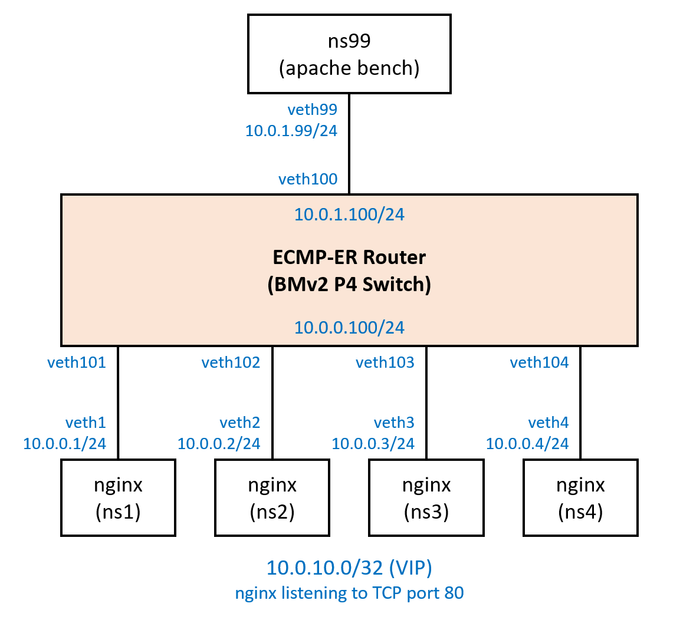

# How to Run ECMP-ER Demo

Table of Contents
- [Setup BMv2 environment and Build P4/XDP](#setup-bmv2-environment-and-build-p4xdp)
  - [Install multipass](#install-multipass)
  - [Create Ubuntu 22.04 VM using cloud init YAML script](#create-ubuntu-2204-vm-using-cloud-init-yaml-script)
  - [Build XDP program](#build-xdp-program)
  - [Install p4c and bmv2](#install-p4c-and-bmv2)
  - [Build P4 code](#build-p4-code)
- [Demo Topology and common setup](#demo-topology-and-common-setup)
  - [Create netns for HTTP and Tester Server](#create-netns-for-http-and-tester-server)
  - [add default route to netns with static ARP (MAC) entry](#add-default-route-to-netns-with-static-arp-mac-entry)
  - [Start Nginx HTTP server (allow 'Nginx Full' using ufw)](#start-nginx-http-server-allow-nginx-full-using-ufw)
  - [Start ECMP-ER Router (bmv2) and controller (`c4bmv2.py`)](#start-ecmp-er-router-bmv2-and-controller-c4bmv2py)
  - [install neighbor and route entries to ECMP-ER Router (bmv2)](#install-neighbor-and-route-entries-to-ecmp-er-router-bmv2)
- [Demo 1: Manually confirm ECMP-ER operation](#demo-1-manually-confirm-ecmp-er-operation)
  - [Result](#result)
    - [XDP attached](#xdp-attached)
    - [XDP detached](#xdp-detached)
- [Demo 2: Apache Bench](#demo-2-apache-bench)
  - [Add a Server to ECMP-ER Router](#add-a-server-to-ecmp-er-router)
  - [Start monitoring traffic](#start-monitoring-traffic)
  - [Demo 2: Senario 1: Load Balancing with out ECMP-ER](#demo-2-senario-1-load-balancing-with-out-ecmp-er)
    - [1. Remove XDP](#1-remove-xdp)
    - [2-a. Send traffic from ns99 using apache bench](#2-a-send-traffic-from-ns99-using-apache-bench)
    - [2-b. Add/Del Servers](#2-b-adddel-servers)
    - [Result](#result-1)
  - [Demo 2: Senario 2: Load Balancing with ECMP-ER](#demo-2-senario-2-load-balancing-with-ecmp-er)
    - [1. Attach XDP program to virtual NIC of HTTP Servers](#1-attach-xdp-program-to-virtual-nic-of-http-servers)
    - [2-a. Send traffic from ns99 using apache bench](#2-a-send-traffic-from-ns99-using-apache-bench-1)
    - [2-b. Add/Del Servers](#2-b-adddel-servers-1)
    - [Result](#result-2)
- [Appendix: Demo 1 Tables](#appendix-demo-1-tables)

## Setup BMv2 environment and Build P4/XDP

This example uses [Canonical Multipass](https://multipass.run/)  to create VM and stup BMv2/p4c environment.
You could also use any other environment where you can run BMv2, p4c and XDP.

### Install multipass

```
sudo snap install multipass
```

### Create Ubuntu 22.04 VM using cloud init YAML script

- what will `bmv2-cloud-init.yaml` do?
  - install dependencies
  - install XDP prerequisites (linux-tools, linux-headers)
  - install p4runtime-shell, Flask, etc.

```
$ time multipass launch 22.04 -n ecmper -c8 -m32G -d20G \
--timeout 3600 --cloud-init ecmper-cloud-init.yaml

Launched: ecmper

real    2m58.764s
user    0m0.102s
sys     0m0.155s
```

Mount project dir to VM.

```
> multipass mount <source> <target>
> multipass mount <source> <name>[:<path>]

ecmper$ multipass mount ./ ecmper:/home/ubuntu/ecmper

$ multipass info ecmper
Name:           ecmper
State:          Running
IPv4:           10.209.103.160
Release:        Ubuntu 22.04.1 LTS
Image hash:     3100a27357a0 (Ubuntu 22.04 LTS)
Load:           0.10 0.23 0.24
Disk usage:     4.9G out of 19.2G
Memory usage:   453.8M out of 31.4G
Mounts:         /home/ebiken/sandbox/ecmper => /home/ubuntu/ecmper
                    UID map: 1000:default
                    GID map: 1000:default

>>> Enter VM

$ multipass shell ecmper

>>> Check directory including source code is mounted

ubuntu@ecmper:~$ ls ecmper/
HOWTO-ECMPER-DEMO.md  build_ecmper_bmv2.sh    ecmper-english-IOTS2022.pdf  p4src   tools
README.md             ecmper-cloud-init.yaml  examples                     scrach  xdp
```

### Build XDP program

> See `ecmper-cloud-init.yaml` for dependencies required to build XDP

```
$ cd ecmper/xdp
ecmper/xdp$ make

ecmper/xdp$ ls
Makefile  README.md  er-stat  er-stat.c  include  redirect.c  redirect.o  test
```

### Install p4c and bmv2

apt package is available for Ubuntu 20.04 and newer. (Thanks!!)

```
$ cd ecmper/tools
ecmper/tools$ ./p4_installer.sh
```

### Build P4 code

```
$ cd ecmper
ecmper$ ./build_ecmper_bmv2.sh
```

Artifacts will be stored under `build.ecmper.bmv2/`

## Demo Topology and common setup



- 4 netns of ngninx (HTTP Server)
  - limit each veth to 100Mbps? using Qdisc
- 1 netns running Apache Bench (Tester Server)
- BMv2 P4 Switch (ECMP-ER Router) running on the host

### Create netns for HTTP and Tester Server

```
$ cd ecmper/tools
ecmper/tools$ sudo ./ecmper-netns-bmv2.sh -c 4

> run below to remove netns
ecmper/tools$ sudo ./tools/ecmper-netns-bmv2.sh -d 4
```

### add default route to netns with static ARP (MAC) entry

```
ecmper/tools$ ./netns-addroute.sh
```

### Start Nginx HTTP server (allow 'Nginx Full' using ufw)

```
$ cd ecmper/tools
ecmper/tools$ ./start-nginx.sh
```

Check nginx and ufw status

```
$ ps aux | grep nginx
root       18784  0.0  0.0  55196  1676 ?        Ss   10:53   0:00 nginx: master process nginx -c /home/ubuntu/scrach/tools/nginx.conf
www-data   18785  0.0  0.0  55676  5332 ?        S    10:53   0:00 nginx: worker process
root       18912  0.0  0.0  55196  1676 ?        Ss   10:53   0:00 nginx: master process nginx -c /home/ubuntu/scrach/tools/nginx.conf
www-data   18913  0.0  0.0  55676  5192 ?        S    10:53   0:00 nginx: worker process
root       19038  0.0  0.0  55196  1684 ?        Ss   10:53   0:00 nginx: master process nginx -c /home/ubuntu/scrach/tools/nginx.conf
www-data   19039  0.0  0.0  55676  5356 ?        S    10:53   0:00 nginx: worker process
root       19164  0.0  0.0  55196  1676 ?        Ss   10:53   0:00 nginx: master process nginx -c /home/ubuntu/scrach/tools/nginx.conf
www-data   19165  0.0  0.0  55676  5316 ?        S    10:53   0:00 nginx: worker process

$ sudo ip netns exec ns1 ufw status
Status: active

To                         Action      From
--                         ------      ----
OpenSSH                    ALLOW       Anywhere
Nginx Full                 ALLOW       Anywhere
OpenSSH (v6)               ALLOW       Anywhere (v6)
Nginx Full (v6)            ALLOW       Anywhere (v6)
```

> CAUTION
> - Do not remove allow 'OpenSSH'
> - Multipass seems to fail to start VM if SSH access is not allowed (even for netns)

### Start ECMP-ER Router (bmv2) and controller (`c4bmv2.py`)

Start ECMP-ER Router (bmv2)

> `-d` option will add `--log-console` for debugging

```
$ cd ecmper/tools
ecmper/tools$ ./start-ecmper-bmv2.sh

> which will run below command to start bmv2
sudo simple_switch_grpc --device-id 1 \
-i 0@veth100 -i 1@veth101 -i 2@veth102 -i 3@veth103 -i 4@veth104 \
../build.ecmper.bmv2/ecmper_bmv2.json
```

Start controller

```
ecmper/tools$ ./c4bmv2.py
```

### install neighbor and route entries to ECMP-ER Router (bmv2) 

```
ecmper/tools$ ./ecmper-config-base.sh
```

Notes:
- Adding and Removing 10.0.10.0/32 routes causes ECMP-ER.
- Entries based on [Demo Topology and common setup](#demo-topology-and-common-setup)
- `http` command is enabled by [httpie.io](https://httpie.io/)

```
> ecmper/tools$ cat ecmper-config-base.sh
#!/usr/bin/env bash

# install neighbor and route entries to ECMP-ER Router (bmv2)

# clear all tables (except for drop entry in cur_nh, prv_nh)
http PUT localhost:5000/clear

# Neighbor Entries
# @app.route("/neigh/add/<nh_addr>/<int:port>/<dstmac>", methods = ["PUT"])
http PUT localhost:5000/neigh/add/10.0.0.1/1/02:03:04:05:06:01
http PUT localhost:5000/neigh/add/10.0.0.2/2/02:03:04:05:06:02
http PUT localhost:5000/neigh/add/10.0.0.3/3/02:03:04:05:06:03
http PUT localhost:5000/neigh/add/10.0.0.4/4/02:03:04:05:06:04

http PUT localhost:5000/neigh/add/10.0.1.99/0/02:03:04:05:06:99

# Show table entries
http localhost:5000/tables
```

## Demo 1: Manually confirm ECMP-ER operation

This demo will manually change ECMP-ER table while capturing packet to see how ECMP-ER works.

- Follow below steps while XDP is detached and attached.
- Do not forget to setup environment following [Demo Topology and common setup](#demo-topology-and-common-setup)
- Make sure to stop/start BMv2 and Controller between tests.

0. Attach or Detach XDP
1. Install Neighbor and route entries
2. Start capturing packet on veth100, veth101, veth102
3. Add server ns1 to table
4. Start HTTP connection to VIP (TCP port 80)
5. Add server ns2 to table
6. Send HTTP GET request to VIP


```
> 0. Attach or Detach XDP

# attach
ecmper/tools$ sudo ./setup-xdp.sh -a -f

# detach
ecmper/tools$ sudo ./setup-xdp.sh -d

# Confirm XDP program is attached or detached
sudo ip netns exec ns1 ip link show veth1

> 1. Install Neighbor and route entries

ecmper/tools$ ./ecmper-config-base.sh

> 2. Start capturing packet on veth100, veth101, veth102

sudo tcpdump -i veth100 -w ecmper-veth100.trc
sudo tcpdump -i veth101 -w ecmper-veth101.trc
sudo tcpdump -i veth102 -w ecmper-veth102.trc

sudo tcpdump -i veth100 -w ecmper-xdp-veth100.trc
sudo tcpdump -i veth101 -w ecmper-xdp-veth101.trc
sudo tcpdump -i veth102 -w ecmper-xdp-veth102.trc

> 3. Add server ns1 to table

http PUT localhost:5000/add/10.0.10.0/32/10.0.0.1
http PUT localhost:5000/install
http localhost:5000/tables

> 4. Start HTTP connection to VIP (using nc)

sudo ip netns exec ns99 nc 10.0.10.0 80 -p 8081

> 4. Add server ns2 to table

http PUT localhost:5000/add/10.0.10.0/32/10.0.0.2
http PUT localhost:5000/install
http localhost:5000/tables

> 5. Send HTTP GET request to VIP (om terminal you ran nc)

GET /10B.txt HTTP/1.0
```

> See [Appendix: Demo 1 Tables](#appendix-demo-1-tables) for example output of table entries

### Result

> see slide [How to run demo slides (pdf)](./HOWTO-ECMPER-DEMO-slides.pdf) for exaplanation including packet flow

packets are stored under [examples/](examples/)

#### XDP attached

GET request will be redirected by server and sent to correct server.

packets: ecmper-xdp-veth100.trc  ecmper-xdp-veth101.trc  ecmper-xdp-veth102.trc

```
ubuntu@ecmper:~$ sudo ip netns exec ns99 nc 10.0.10.0 80 -p 8081
GET /10B.txt HTTP/1.0

HTTP/1.1 200 OK
Server: nginx/1.18.0 (Ubuntu)
Date: Wed, 28 Dec 2022 13:21:03 GMT
Content-Type: text/plain
Content-Length: 11
Last-Modified: Wed, 28 Dec 2022 13:20:32 GMT
Connection: close
ETag: "63ac42a0-b"
Accept-Ranges: bytes

1234567890
Connection closed by foreign host.
```

#### XDP detached

TCP RST will be returned for GET request from the server.

packets: ecmper-veth100.trc  ecmper-veth101.trc  ecmper-veth102.trc

```
ubuntu@ecmper:~$ sudo ip netns exec ns99 nc 10.0.10.0 80 -p 8081
GET /10B.txt HTTP/1.0

ubuntu@ecmper:~$
```

## Demo 2: Apache Bench

This demo will use script to automatically add/del servers from the ECMP-ER table.
Apache Bench is used to send traffic and check how many requests have failed.

- Do not forget to setup environment following [Demo Topology and common setup](#demo-topology-and-common-setup)

### Add a Server to ECMP-ER Router

```
http PUT localhost:5000/add/10.0.10.0/32/10.0.0.1
http PUT localhost:5000/install
```

Check P4 Table Entries

```
$ http localhost:5000/tables
-------------------------------------
 Table SwitchIngress.ecmper.ipv4_lpm
-------------------------------------
1 | match: dstAddr: 10.0.10.0/32 | action: set_nh_index( cur_nh_offset: 1 cur_nh_count: 1 prv_nh_offset: 1 prv_nh_count: 0 )
-----------------------------------
 Table SwitchIngress.ecmper.cur_nh
-----------------------------------
1 | match: nh_index: 0 | action: drop( )
2 | match: nh_index: 1 | action: set_nexthop( nexthop: 10.0.0.1 )
-----------------------------------
 Table SwitchIngress.ecmper.prv_nh
-----------------------------------
1 | match: nh_index: 0 | action: drop( )
----------------------------------
 Table SwitchIngress.ecmper.neigh
----------------------------------
1 | match: nh_addr: 10.0.0.1 | action: set_output( dstMac: 02:03:04:05:06:01 port: 1 )
2 | match: nh_addr: 10.0.0.2 | action: set_output( dstMac: 02:03:04:05:06:02 port: 2 )
3 | match: nh_addr: 10.0.0.3 | action: set_output( dstMac: 02:03:04:05:06:03 port: 3 )
4 | match: nh_addr: 10.0.0.4 | action: set_output( dstMac: 02:03:04:05:06:04 port: 4 )
5 | match: nh_addr: 10.0.1.99 | action: set_output( dstMac: 02:03:04:05:06:99 port: 0 )
```

### Start monitoring traffic

You can monitor traffic of each interface using `ipsl.py` python script.

- `ipsl.py` is written by [Ryo Nakamura, a.k.a. upa](https://gist.github.com/upa)
- original file can be downloaded from here: [upa/ipsl](https://gist.github.com/upa/a7ddce981c734c8cf0e5d12a3722c5f2)
- remove `--rx` or replace with `--tx` to show Tx traffic

```
ecmper/tools$ ./ipsl.py -g veth --rx
veth100      rx 1.38 Mbps 2.60 Kpps
veth101      rx 92.57 Mbps 3.34 Kpps
veth102      rx 0.00 bps 0.00 pps
veth103      rx 0.00 bps 0.00 pps
veth104      rx 0.00 bps 0.00 pps
...snip...
```

### Demo 2: Senario 1: Load Balancing with out ECMP-ER

First try without enabling ECMP-ER (no XDP)

Steps:
- 1 Remove XDP
- 2-a Send traffic from ns99 using apache bench
- 2-b Add/Del Servers

> Note: 2-a/b should be done with no delay

#### 1. Remove XDP

```
ecmper/tools$ sudo ./setup-xdp.sh -d
```

#### 2-a. Send traffic from ns99 using apache bench

```
> ab -r -n <total_requests> -c <concurrent_connections> <URL>
> run one of below examples
> Note: -r won't exit on socket receive errors.

sudo ip netns exec ns99 ab -r -n 360 -c 12 http://10.0.10.0/1m.img
```

#### 2-b. Add/Del Servers

script below will add server id 2,3,4 and then del server id 4,3,2

```
> ./ecmper-config-adddel.sh -i <interval-sec> -s <start_id> -e <end_id>

ecmper/tools$ ./ecmper-config-adddel.sh -i 4 -s 2 -e 4

> `-d ` option will show tables each time add/del

ecmper/tools$ ./ecmper-config-adddel.sh -i 4 -s 2 -e 4 -d
```

#### Result

You should see `Failed requests:` since Server will reset packet since it does not own TCP connection.

```
ubuntu@ecmper:~$ sudo ip netns exec ns99 ab -r -n 360 -c 12 http://10.0.10.0/1m.img
This is ApacheBench, Version 2.3 <$Revision: 1879490 $>
Copyright 1996 Adam Twiss, Zeus Technology Ltd, http://www.zeustech.net/
Licensed to The Apache Software Foundation, http://www.apache.org/

Benchmarking 10.0.10.0 (be patient)
Completed 100 requests
Completed 200 requests
Completed 300 requests
Finished 360 requests


Server Software:        nginx/1.18.0
Server Hostname:        10.0.10.0
Server Port:            80

Document Path:          /1m.img
Document Length:        1048576 bytes

Concurrency Level:      12
Time taken for tests:   34.979 seconds
Complete requests:      360
Failed requests:        120
   (Connect: 0, Receive: 40, Length: 40, Exceptions: 40)
Total transferred:      357476440 bytes
HTML transferred:       357381664 bytes
Requests per second:    10.29 [#/sec] (mean)
Time per request:       1165.979 [ms] (mean)
Time per request:       97.165 [ms] (mean, across all concurrent requests)
Transfer rate:          9980.11 [Kbytes/sec] received

Connection Times (ms)
              min  mean[+/-sd] median   max
Connect:        2  108  96.3    104    1189
Processing:   206 1045 256.7   1042    2628
Waiting:        0   93  66.3     96     572
Total:        248 1153 278.9   1137    2641

Percentage of the requests served within a certain time (ms)
  50%   1137
  66%   1213
  75%   1275
  80%   1370
  90%   1507
  95%   1637
  98%   1701
  99%   1840
 100%   2641 (longest request)
```

### Demo 2: Senario 2: Load Balancing with ECMP-ER

Now try enabling ECMP-ER (XDP attached)

Step 2-a and b is same as Senario 1 (ECMP)

Steps:
- 1 Attach XDP program to virtual NIC of HTTP Servers
- 2-a Send traffic from ns99 using apache bench
- 2-b Add/Del Servers

> Note: 2-a/b should be done with no delay

#### 1. Attach XDP program to virtual NIC of HTTP Servers

Attach XDP

```
tools$ ./setup-xdp.sh -a -f
```

Confirm XDP program is attached

```
$ sudo ip netns exec ns1 ip link show veth1
6: veth1@if5: <BROADCAST,MULTICAST,UP,LOWER_UP> mtu 3498 xdp qdisc noqueue state UP mode DEFAULT group default qlen 1000
    link/ether 02:03:04:05:06:01 brd ff:ff:ff:ff:ff:ff link-netnsid 0
    prog/xdp id 31 tag 419e0c07dbb5850a jited

> "prog/xdp id 31 tag 419e0c07dbb5850a jited" is the XDP program attached to veth1
> Now compare with ns99 which does not have XDP program attached

$ sudo ip netns exec ns99 ip link show veth99
4: veth99@if3: <BROADCAST,MULTICAST,UP,LOWER_UP> mtu 3498 qdisc noqueue state UP mode DEFAULT group default qlen 1000
    link/ether 02:03:04:05:06:99 brd ff:ff:ff:ff:ff:ff link-netnsid 0
```

#### 2-a. Send traffic from ns99 using apache bench

```
sudo ip netns exec ns99 ab -r -n 360 -c 12 http://10.0.10.0/1m.img
```

#### 2-b. Add/Del Servers

```
tools$ ./ecmper-config-adddel.sh -i 4 -s 2 -e 4
```

#### Result

You should see `Failed requests: 0` since Server will return packet to ECMP-ER Router if it does not own TCP connection.

```
ubuntu@ecmper:~/scrach/tools$ ./ecmper-config-adddel.sh -i 4 -s 2 -e 4

ubuntu@ecmper2:~$ sudo ip netns exec ns99 ab -r -n 360 -c 12 http://10.0.10.0/1m.img
This is ApacheBench, Version 2.3 <$Revision: 1879490 $>
Copyright 1996 Adam Twiss, Zeus Technology Ltd, http://www.zeustech.net/
Licensed to The Apache Software Foundation, http://www.apache.org/

Benchmarking 10.0.10.0 (be patient)
Completed 100 requests
Completed 200 requests
Completed 300 requests
Finished 360 requests


Server Software:        nginx/1.18.0
Server Hostname:        10.0.10.0
Server Port:            80

Document Path:          /1m.img
Document Length:        1048576 bytes

Concurrency Level:      12
Time taken for tests:   38.191 seconds
Complete requests:      360
Failed requests:        0
Total transferred:      377582400 bytes
HTML transferred:       377487360 bytes
Requests per second:    9.43 [#/sec] (mean)
Time per request:       1273.035 [ms] (mean)
Time per request:       106.086 [ms] (mean, across all concurrent requests)
Transfer rate:          9654.95 [Kbytes/sec] received

Connection Times (ms)
              min  mean[+/-sd] median   max
Connect:        2  139 124.0    132    1139
Processing:   137 1123 303.9   1060    2866
Waiting:        3  119  49.2    122     282
Total:        152 1263 329.4   1206    2917

Percentage of the requests served within a certain time (ms)
  50%   1206
  66%   1307
  75%   1428
  80%   1486
  90%   1637
  95%   1798
  98%   2245
  99%   2611
 100%   2917 (longest request)
```

## Appendix: Demo 1 Tables

```
ubuntu@ecmper2:~/scrach/tools$ http localhost:5000/tables
HTTP/1.1 200 OK
Connection: close
Content-Length: 949
Content-Type: text/html; charset=utf-8
Date: Tue, 17 Jan 2023 05:27:03 GMT
Server: Werkzeug/2.2.2 Python/3.10.6

-------------------------------------
 Table SwitchIngress.ecmper.ipv4_lpm
-------------------------------------
-----------------------------------
 Table SwitchIngress.ecmper.cur_nh
-----------------------------------
1 | match: nh_index: 0 | action: drop( )
-----------------------------------
 Table SwitchIngress.ecmper.prv_nh
-----------------------------------
1 | match: nh_index: 0 | action: drop( )
----------------------------------
 Table SwitchIngress.ecmper.neigh
----------------------------------
1 | match: nh_addr: 10.0.0.1 | action: set_output( dstMac: 02:03:04:05:06:01 port: 1 )
2 | match: nh_addr: 10.0.0.2 | action: set_output( dstMac: 02:03:04:05:06:02 port: 2 )
3 | match: nh_addr: 10.0.0.3 | action: set_output( dstMac: 02:03:04:05:06:03 port: 3 )
4 | match: nh_addr: 10.0.0.4 | action: set_output( dstMac: 02:03:04:05:06:04 port: 4 )
5 | match: nh_addr: 10.0.1.99 | action: set_output( dstMac: 02:03:04:05:06:99 port: 0 )

ubuntu@ecmper2:~/scrach/tools$ http localhost:5000/tables
HTTP/1.1 200 OK
Connection: close
Content-Length: 1140
Content-Type: text/html; charset=utf-8
Date: Tue, 17 Jan 2023 05:22:26 GMT
Server: Werkzeug/2.2.2 Python/3.10.6

-------------------------------------
 Table SwitchIngress.ecmper.ipv4_lpm
-------------------------------------
1 | match: dstAddr: 10.0.10.0/32 | action: set_nh_index( cur_nh_offset: 1 cur_nh_count: 1 prv_nh_offset: 1 prv_nh_count: 0 )
-----------------------------------
 Table SwitchIngress.ecmper.cur_nh
-----------------------------------
1 | match: nh_index: 0 | action: drop( )
2 | match: nh_index: 1 | action: set_nexthop( nexthop: 10.0.0.1 )
-----------------------------------
 Table SwitchIngress.ecmper.prv_nh
-----------------------------------
1 | match: nh_index: 0 | action: drop( )
----------------------------------
 Table SwitchIngress.ecmper.neigh
----------------------------------
1 | match: nh_addr: 10.0.0.1 | action: set_output( dstMac: 02:03:04:05:06:01 port: 1 )
2 | match: nh_addr: 10.0.0.2 | action: set_output( dstMac: 02:03:04:05:06:02 port: 2 )
3 | match: nh_addr: 10.0.0.3 | action: set_output( dstMac: 02:03:04:05:06:03 port: 3 )
4 | match: nh_addr: 10.0.0.4 | action: set_output( dstMac: 02:03:04:05:06:04 port: 4 )
5 | match: nh_addr: 10.0.1.99 | action: set_output( dstMac: 02:03:04:05:06:99 port: 0 )


ubuntu@ecmper2:~/scrach/tools$ http localhost:5000/tables
HTTP/1.1 200 OK
Connection: close
Content-Length: 1668
Content-Type: text/html; charset=utf-8
Date: Tue, 17 Jan 2023 05:23:13 GMT
Server: Werkzeug/2.2.2 Python/3.10.6

-------------------------------------
 Table SwitchIngress.ecmper.ipv4_lpm
-------------------------------------
1 | match: dstAddr: 10.0.10.0/32 | action: set_nh_index( cur_nh_offset: 1 cur_nh_count: 8 prv_nh_offset: 1 prv_nh_count: 1 )
-----------------------------------
 Table SwitchIngress.ecmper.cur_nh
-----------------------------------
1 | match: nh_index: 0 | action: drop( )
2 | match: nh_index: 1 | action: set_nexthop( nexthop: 10.0.0.1 )
3 | match: nh_index: 2 | action: set_nexthop( nexthop: 10.0.0.2 )
4 | match: nh_index: 3 | action: set_nexthop( nexthop: 10.0.0.1 )
5 | match: nh_index: 4 | action: set_nexthop( nexthop: 10.0.0.2 )
6 | match: nh_index: 5 | action: set_nexthop( nexthop: 10.0.0.1 )
7 | match: nh_index: 6 | action: set_nexthop( nexthop: 10.0.0.2 )
8 | match: nh_index: 7 | action: set_nexthop( nexthop: 10.0.0.1 )
9 | match: nh_index: 8 | action: set_nexthop( nexthop: 10.0.0.2 )
-----------------------------------
 Table SwitchIngress.ecmper.prv_nh
-----------------------------------
1 | match: nh_index: 0 | action: drop( )
2 | match: nh_index: 1 | action: set_nexthop( nexthop: 10.0.0.1 )
----------------------------------
 Table SwitchIngress.ecmper.neigh
----------------------------------
1 | match: nh_addr: 10.0.0.1 | action: set_output( dstMac: 02:03:04:05:06:01 port: 1 )
2 | match: nh_addr: 10.0.0.2 | action: set_output( dstMac: 02:03:04:05:06:02 port: 2 )
3 | match: nh_addr: 10.0.0.3 | action: set_output( dstMac: 02:03:04:05:06:03 port: 3 )
4 | match: nh_addr: 10.0.0.4 | action: set_output( dstMac: 02:03:04:05:06:04 port: 4 )
5 | match: nh_addr: 10.0.1.99 | action: set_output( dstMac: 02:03:04:05:06:99 port: 0 )
```
